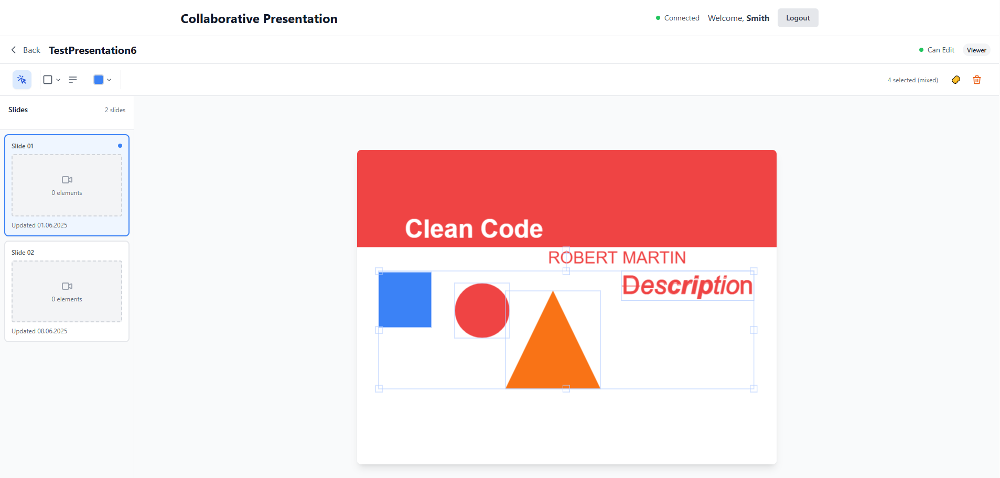

# Collaborative Presentation Software

A real-time collaborative web application for creating and editing presentations. Allows multiple users to simultaneously work on presentations with role-based access control and live synchronization of changes.

<div align="center">
  
</div>

## 🚀 Key Features

### Role-Based System
- **Creator** - full control over the presentation
- **Editor** - can edit slides
- **Viewer** - read-only access

### Collaborative Editing
- ✅ **Real-time synchronization** via WebSocket (SignalR)
- ✅ **Multi-user editing** - multiple users can edit different slides simultaneously
- ✅ **Optimistic updates** for smooth UX
- ✅ **User management** - Creator can assign roles to participants

### Drawing Tools
- 📝 **Text blocks** with markdown formatting support
- 🔴 **Geometric shapes**: rectangle, circle, triangle
- ➖ **Lines** in all directions
- 🎨 **Color picker** for elements
- 🧽 **Deletion** of individual elements or slide clearing

### Presentation Mode
- 🎥 **Full-screen presentation mode**
- 👥 **Synchronized viewing** - all participants see the same slide
- 🎮 **Slide navigation** controlled by presenter

## 🛠 Technology Stack

### Backend (.NET)
- **ASP.NET Core** - main framework
- **Entity Framework Core** - ORM for database operations
- **SignalR** - real-time communication
- **Clean Architecture** - Domain, Application, Infrastructure layers
- **SQL Server** - database

### Frontend (React)
- **React 18** with TypeScript
- **Fabric.js** - canvas for drawing and editing
- **Tailwind CSS** - styling
- **Lucide Icons** - icon library
- **SignalR Client** - WebSocket connection

## 📦 Project Structure

```
├── Backend/
│   ├── Domain/           # Domain models
│   ├── Application/      # Business logic and services
│   ├── Infrastructure/   # SignalR, external services
│   └── Persistence/      # Entity Framework, repositories
├── Frontend/
│   ├── src/
│   │   ├── components/   # React components
│   │   ├── hooks/        # Custom hooks
│   │   ├── services/     # API and SignalR services
│   │   └── types/        # TypeScript types
└── README.md
```

## 🎯 Core Functionality

### 1. Creating Presentations
- User provides nickname and creates new presentation
- Automatically becomes Creator
- Gets list of connected users

### 2. Joining Presentations
- Select from list of available presentations
- Automatically assigned Viewer role
- Real-time updates when changes occur

### 3. Slide Management
- **Creator**: can add/delete slides
- **Editor**: can edit slide content
- **Viewer**: read-only access

### 4. Element Editing
- Drag-to-create for shapes and lines
- Click to add text elements
- Select and move elements
- Group selection and operations
- Change colors and properties

### 5. Real-time Synchronization
- All changes visible instantly to all participants
- Change author indication
- All changes persisted on server

### 6. Presentation Mode
- Full-screen slide viewing
- All participants synchronized with presenter
- Slide navigation controls

## 🔧 Implementation Details

### Canvas and Fabric.js
- **Fabric.js** for powerful canvas editing capabilities
- Custom tools via `useDragToCreate` hook
- Optimized rendering and performance

### State Management
- React local state for UI management
- Slide caching for fast navigation
- Optimistic updates for better UX

### SignalR Integration
- Real-time events for all changes
- User grouping by presentation
- Reliable connection handling and reconnection

### Responsive Design
- Adaptive layout for different screen sizes
- Canvas scaling to window size
- Optimized UI for tablets

## 🎨 UI/UX Features

- **Modern design** with Tailwind CSS
- **Intuitive navigation** between slides
- **Visual feedback** for all actions
- **Smooth animations** and transitions
- **Accessibility** support

## 📋 Requirements

- **.NET 8** or higher
- **Node.js 18** or higher
- **SQL Server** or compatible database
- Modern browser with WebSocket support

## 🚀 Getting Started

### Backend
```bash
cd Backend
dotnet restore
dotnet run
```

### Frontend
```bash
cd Frontend
npm install
npm start
```

### Production Deployment
For production deployment, you need to replace example configuration data with your actual production values:

- **Database connection strings** in `appsettings.json`
- **CORS origins** for your domain
- **SignalR hub URLs** in frontend configuration
- **API endpoints** and base URLs
- **Environment-specific settings**

Make sure to update all placeholder values in configuration files before deploying to production.

## 📝 Development Features

### Architectural Decisions
- **Clean Architecture** for maintainability
- **SOLID principles** in class design
- **Repository pattern** for data access
- **Command/Query separation** in Application layer

### Performance
- **Optimized canvas rendering**
- **Slide caching** for fast navigation
- **Debouncing** for frequent updates
- **Lazy loading** of elements

### Security
- **Input validation** for all data
- **User content sanitization**
- **Rate limiting** for API calls

---

**This project serves as a demonstration of modern full-stack development with emphasis on real-time collaboration and quality user experience.**